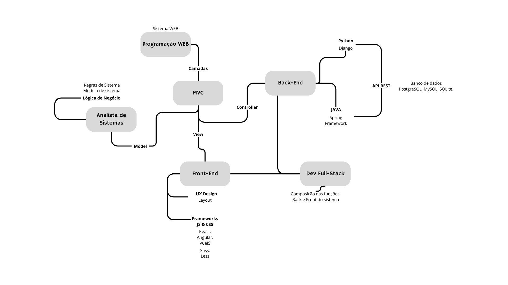
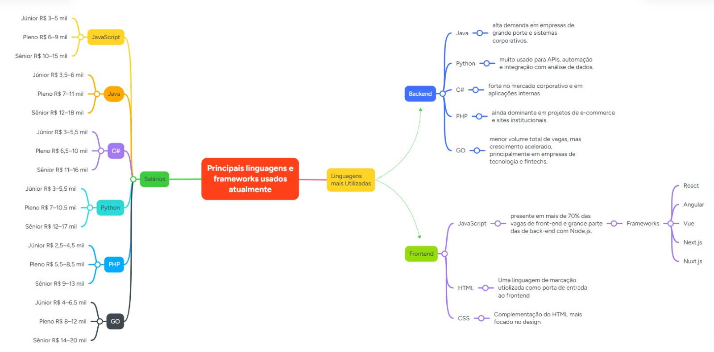
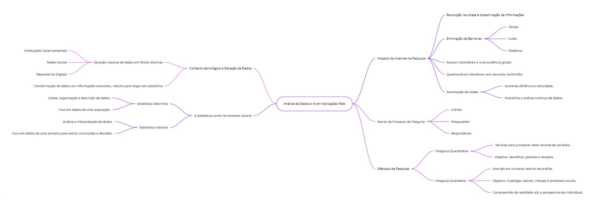
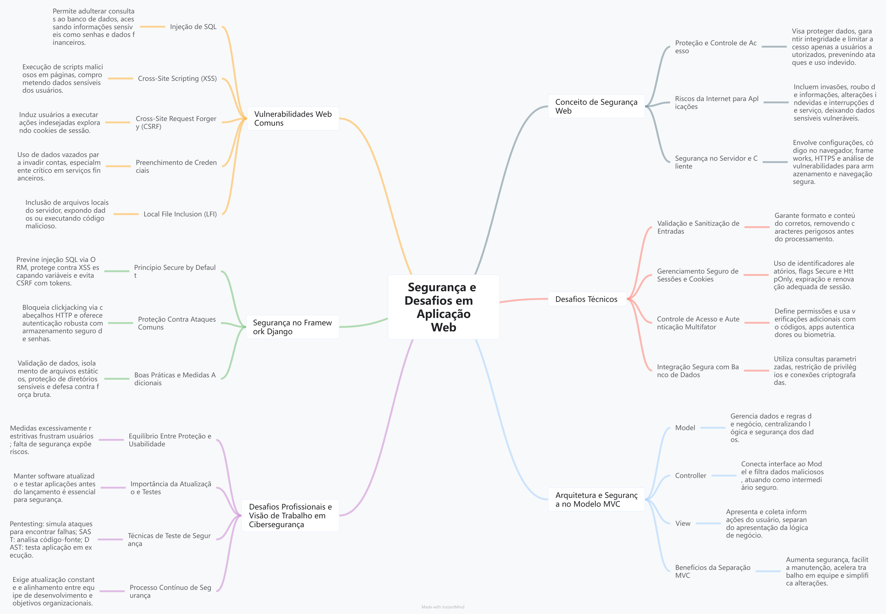
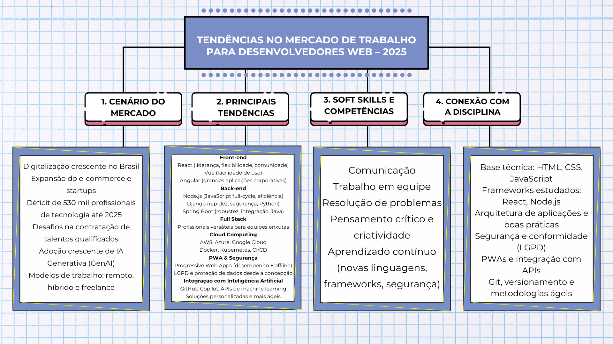

**História e Evolução do Desenvolvimento Web: Das Origens à Era Moderna**

**Autores: Cesar, Caio e Guilherme**

**Introdução**

O desenvolvimento web percorreu uma jornada extraordinária desde seus primórdios no final dos anos 1980 até os dias atuais. Esta evolução não apenas transformou a forma como acessamos e compartilhamos informações, mas também criou um dos setores mais dinâmicos e promissores da tecnologia moderna. Compreender esta trajetória histórica é fundamental para qualquer profissional que deseje ingressar na área, pois oferece contexto essencial sobre as tecnologias, desafios e oportunidades que moldam o mercado atual.

**A Evolução Histórica do Desenvolvimento Web**

Os Primórdios: A Era Pré-Web (1989-1991)

A história da web começou com um problema prático enfrentado por Tim Berners-Lee e sua equipe no CERN. Os pesquisadores precisavam compartilhar informações científicas, mas utilizavam programas proprietários incompatíveis entre si, dificultando a colaboração. A solução veio com a criação do HTML (Hypertext Markup Language) em 1991, uma linguagem de marcação projetada para ser tecnologicamente neutra e facilmente compartilhável através de redes.
O primeiro site da web, criado pelo próprio Berners-Lee em dezembro de 1990, era uma página simples com fundo branco, texto preto e links azuis - características que ainda hoje reconhecemos como padrões do HTML básico. Esta página serviu como guia para a World Wide Web, demonstrando o potencial revolucionário de conectar documentos através de hiperlinks.
A Idade do Conteúdo Estático (1991-1995)
Durante os primeiros anos, as páginas web eram essencialmente versões digitais de documentos impressos. O HTML permitia apenas conteúdo estático, sem elementos dinâmicos como animações, vídeos ou formulários interativos. Os desenvolvedores enfrentavam desafios significativos, como a necessidade de codificar manualmente elementos repetitivos (como barras laterais) em cada página individual.
A navegação dependia inteiramente de hiperlinks, e qualquer atualização requeria modificação manual dos arquivos HTML. Esta abordagem artesanal, embora funcional, apresentava limitações evidentes em termos de escalabilidade e manutenibilidade.

A Revolução do Servidor e o Conteúdo Dinâmico (Meados dos anos 1990)

O advento da renderização no servidor (Server-Side Rendering - SSR) marcou um ponto de virada crucial. Linguagens como PHP permitiram que os desenvolvedores gerassem HTML dinamicamente, possibilitando conteúdo personalizado, integração com bancos de dados e reutilização de componentes.
Paralelamente, o JavaScript, lançado em 1995, introduziu interatividade às páginas web. Pela primeira vez, era possível criar animações, validar formulários e atualizar conteúdo sem recarregar a página inteira. Esta combinação de tecnologias transformou a web de um meio passivo de consulta em uma plataforma interativa.

A Era CSS e o Design Web (Final dos anos 1990)

A introdução do CSS (Cascading Style Sheets) em 1996 foi comparável ao Renascimento na arte digital. Pela primeira vez, designers puderam separar completamente o conteúdo da apresentação, controlando layout, cores, fontes e aparência geral sem alterar a estrutura HTML. O projeto CSS Zen Garden, lançado em 2003, demonstrou dramaticamente este poder, mostrando como o mesmo documento HTML poderia ser completamente transformado através do CSS.

A Guerra dos Navegadores e a Padronização (Meados a Final dos anos 1990)

O período foi marcado pela intensa competição entre navegadores, iniciando com o Lynx (navegador de linha de comando), seguido pelo Netscape Navigator e Internet Explorer. Esta "guerra" trouxe tanto inovação quanto fragmentação, com diferentes navegadores implementando recursos de forma inconsistente. O jQuery, criado em 2006, emergiu como uma solução para estas incompatibilidades, simplificando manipulações DOM e requisições AJAX.

A Revolução AJAX e a Web 2.0 (Início dos anos 2000)

AJAX (Asynchronous JavaScript and XML) revolucionou a experiência do usuário ao permitir atualizações assíncronas de conteúdo sem recarregar páginas. Esta tecnologia, combinada com o conceito de Web 2.0, enfatizou conteúdo gerado pelo usuário e interações sociais, estabelecendo as bases para as modernas aplicações web.

A Era das Single Page Applications (Anos 2010)

O conceito de Single Page Applications (SPAs) emergiu com frameworks como AngularJS (2010), seguido pelo React (2013) e Vue.js (2014). Estas ferramentas permitiram que aplicações inteiras funcionassem dentro de uma única página, oferecendo experiências mais fluidas e responsivas. A arquitetura baseada em componentes tornou o código mais reutilizável e escalável.

O Renascimento do Server-Side Rendering (Atual)

Paradoxalmente, após a era das SPAs, observamos um renascimento do SSR, agora suportado por metaframeworks como Next.js, Nuxt.js e Angular Universal. Esta tendência é impulsionada por necessidades de SEO, performance inicial e segurança, demonstrando que a evolução tecnológica é cíclica e contextual.

**Conexão com o Conteúdo da Disciplina**

O programa da disciplina reflete diretamente esta evolução histórica, estruturado de forma a proporcionar compreensão progressiva das tecnologias fundamentais:

1. Modelo Cliente-Servidor

O conteúdo inicial sobre arquitetura cliente-servidor conecta-se diretamente com os primórdios da web, quando surgiu a necessidade de computadores se comunicarem através de redes. Compreender este modelo é essencial para entender como as requisições HTTP funcionam e como dados são transferidos na web.

2. Arquitetura MVC

O padrão MVC (Model-View-Controller) representa uma evolução natural dos desafios enfrentados quando o desenvolvimento web se tornou mais complexo. Este padrão separa responsabilidades de forma similar à separação entre HTML (estrutura), CSS (apresentação) e JavaScript (comportamento), conceitos fundamentais da evolução histórica.

3. Fundamentos de Linguagem de Programação

O estudo de fundamentos de programação é crucial porque, como visto na história, o desenvolvimento web evoluiu de páginas estáticas para aplicações complexas. Dominar esses conceitos permite compreender e implementar a lógica por trás das interações web modernas.

4. Desenvolvimento de Aplicações Web

Esta seção conecta-se com toda a evolução das SPAs e frameworks modernos. Os alunos aprenderão a desenvolver aplicações que incorporam décadas de evolução tecnológica, desde HTML básico até frameworks JavaScript avançados.

5. Python e Django

A escolha do Django reflete a importância histórica dos frameworks server-side. Django incorpora o padrão MVC, gerenciamento de sessões, integração com banco de dados e muitas outras funcionalidades que evoluíram ao longo da história da web.

6. Cookies e Sessões

Estes conceitos surgiram historicamente para superar a natureza stateless do protocolo HTTP, permitindo que aplicações web "lembrassem" de usuários entre requisições.

7. Integração com Banco de Dados

Representa a evolução de páginas estáticas para aplicações dinâmicas capazes de armazenar e recuperar informações persistentes.

**Como a Visão de Mercado Guia o Aprendizado Técnico**

Compreensão de Ciclos Tecnológicos

A história demonstra que tecnologias seguem ciclos: emergem, ganham popularidade, enfrentam desafios e eventualmente são substituídas ou evoluem. Compreender estes ciclos ajuda estudantes a:
Priorizar tecnologias fundamentais: HTML, CSS e JavaScript permanecem relevantes apesar de todas as mudanças
Adaptar-se a mudanças: Frameworks específicos mudam, mas conceitos fundamentais persistem
Antecipar tendências: Padrões históricos podem indicar direções futuras

Contexto para Decisões Técnicas

Conhecer a evolução histórica fornece contexto para decisões de arquitetura:
Quando usar SSR vs SPA: Compreender que ambas abordagens têm vantagens específicas
Escolha de frameworks: Entender que não existe "bala de prata", mas sim ferramentas adequadas para contextos específicos
Padrões de design: MVC, por exemplo, surgiu para resolver problemas reais de organização de código

Preparação para o Mercado de Trabalho

A visão histórica prepara profissionais para:
Manutenção de sistemas legados: Muitas empresas ainda utilizam tecnologias "antigas" que fazem parte desta evolução
Comunicação técnica: Explicar decisões arquiteturais com base em contexto histórico
Aprendizado contínuo: Reconhecer que a área está em constante evolução

Desenvolvimento de Pensamento Crítico

Compreender que cada tecnologia surgiu para resolver problemas específicos desenvolve:
Capacidade de análise: Avaliar prós e contras de diferentes soluções
Visão sistêmica: Entender como diferentes componentes se integram
Adaptabilidade: Preparação para futuras mudanças tecnológicas

**Conclusão**

A história do desenvolvimento web revela uma trajetória de constante inovação impulsionada pela necessidade de resolver problemas práticos. Desde o HTML básico de Tim Berners-Lee até os frameworks modernos, cada evolução respondeu a desafios específicos de sua época.
O conteúdo programático da disciplina reflete cuidadosamente esta evolução, proporcionando aos estudantes não apenas conhecimento técnico, mas também contexto histórico essencial. Compreender esta trajetória permite que futuros desenvolvedores tomem decisões mais informadas, adaptem-se mais rapidamente a mudanças e contribuam efetivamente para a contínua evolução da web.
A visão de mercado obtida através desta perspectiva histórica é invaluável: ela transforma o aprendizado de um conjunto de tecnologias isoladas em uma compreensão integrada de como a web evoluiu e continua evoluindo. Esta compreensão não apenas facilita o domínio técnico atual, mas também prepara profissionais para navegar e contribuir com as transformações futuras do desenvolvimento web.
Em um campo onde novas tecnologias emergem constantemente, a capacidade de contextualizar inovações dentro da evolução histórica maior torna-se uma competência fundamental para o sucesso profissional duradouro.

**Mapa Mental: História e Evolução do Desenvolvimento Web**
 
 

**Referências:**

- https://medium.com/trainingcenter/guia-para-carreira-no-desenvolvimento-web-o-in%C3%ADcio-da-hist%C3%B3ria-b6eafdb885a4
- https://www.tenchisecurity.com/br/insights-news/frontending-uma-breve-historia-do-desenvolvimento-web-parte-1
- https://medium.com/@Abhishek-Tiwari/the-history-and-evolution-of-web-development-from-html-to-the-modern-web-982e3f90e891

---

# 🌐 Programação web | Back-end, Front-end e Full-stack

**Autores:**  
João Pedro Gonçalves de Aquino  
Yuri Bargas Oliveira  

---

## 📝 Resumo

Em programação web, três áreas se destacam: front-end, back-end e full-stack. Cada uma delas tem suas especificidades, mas todas desempenham papéis essenciais na construção de sistemas web dinâmicos e interativos. A disciplina de Programação para Web está diretamente conectada ao desenvolvimento web e, neste contexto, compreender os conceitos de front-end, back-end e full-stack ajuda a perceber a importância de cada uma dessas camadas e como elas se integram para criar soluções eficientes e robustas. O front-end é a parte do desenvolvimento web com a qual os usuários interagem diretamente. Ele envolve tudo o que é visível em uma página da web, desde o layout até as interações, passando pela usabilidade e pela experiência do usuário. A principal responsabilidade do desenvolvedor front-end é criar interfaces que sejam intuitivas, atraentes e funcionais, através de frameworks que incrementem a experiência final do sistema. Frameworks modernos como React, Angular e Vue.js têm ganhado popularidade no desenvolvimento front-end, pois facilitam a criação de aplicações mais complexas e dinâmicas, mantendo o código organizado e de fácil manutenção.

O back-end é o lado oculto das aplicações web, aquele que o usuário não vê, mas sem o qual o front-end não funcionaria. Sua principal função é gerenciar a comunicação com o banco de dados, processar as informações recebidas e enviadas pelo front-end e garantir que a aplicação funcione de maneira lógica e eficiente. O back-end lida com as requisições dos usuários, a lógica de negócio e a interação com os dados armazenados. Na disciplina PW, o desenvolvimento back-end é abordado por meio da linguagem Python e do framework Django, ferramentas poderosas para criar aplicações web robustas e escaláveis. O Django segue o padrão MVC (Model-View-Controller), que organiza a aplicação em três camadas distintas. O Model representa os dados e a estrutura do banco de dados, o View lida com a apresentação desses dados e o Controller gerencia a lógica de controle e as interações entre os dois. Dentro do back-end, tecnologias como Python e Django são usadas para processar dados, criar APIs, gerenciar sessões e cookies e lidar com a persistência de dados em bancos como PostgreSQL, MySQL ou SQLite. O Django facilita esse processo, pois já traz ferramentas prontas para criação de modelos de dados, rotas, autenticação de usuários e muito mais, permitindo que o desenvolvedor se concentre na lógica de negócios.

Em uma analogia com a agricultura: enquanto o front é como a área de colheita, que cuida da aparência do produto final, o back é o sistema de irrigação e cuidado do solo que garante que os frutos cheguem saudáveis até a prateleira. Back-end lida com a infraestrutura invisível, mas fundamental para que tudo funcione corretamente.

O desenvolvedor full-stack é aquele que tem a capacidade de trabalhar tanto no front-end quanto no back-end. Esse profissional é como o viticultor que cuida de toda a cadeia produtiva, desde a preparação do solo até a colheita. O programador full-stack precisa ter conhecimentos em ambas as áreas e ser capaz de navegar entre as tecnologias de front-end e back-end. Embora seja possível ser um especialista em apenas uma delas, um full-stack deve entender como as camadas se conectam e interagem, o que inclui trabalhar com APIs, integração de banco de dados, otimização de performance e gerenciamento de servidores.

A criação de uma aplicação web dinâmica e interÓtima ideia! Adicionar citações de autores de referência pode enriquecer o texto e dar mais credibilidade às informações apresentadas.

Ferramentas e Tecnologias

A análise e a visualização de dados são a espinha dorsal de muitas inovações. Para isso, utilizamos plataformas de análise robustas como R e Python, que oferecem bibliotecas poderosas para manipulação e visualização de dados. Ferramentas como Tableau e Power BI facilitam a criação de dashboards interativos, permitindo que as equipes transformem dados brutos em insights claros e acionáveis.

No mundo da inteligência artificial, frameworks de IA como TensorFlow, PyTorch e Scikit-learn são essenciais. Eles nos dão a base necessária para desenvolver modelos de aprendizado de máquina, desde os mais simples até redes neurais complexas. Para integrar essas capacidades em aplicações do dia a dia, contamos com APIs de IA. Essas interfaces permitem que desenvolvedores usem serviços pré-treinados, como reconhecimento de imagem e análise de sentimentos, em suas aplicações web sem precisar construir os modelos do zero.

    "A ciência de dados é a arte de transformar dados em conhecimento." - V. C. K. Varma

Aplicações Práticas em Web

A inteligência artificial tem revolucionado a experiência online, tornando-a mais personalizada e eficiente.

Um exemplo clássico são os sistemas de recomendações personalizadas. Ao analisar o comportamento de navegação e as preferências de um usuário, a IA consegue sugerir produtos, filmes ou artigos que ele provavelmente irá gostar, aumentando o engajamento e a satisfação.

Além disso, a análise de comportamento do usuário em tempo real nos permite entender como as pessoas interagem com um site ou aplicativo. Essa análise é fundamental para otimizar a experiência do usuário (UX) e o design da interface (UI), garantindo que a jornada do usuário seja o mais fluida e intuitiva possível.

No marketing digital, a IA se tornou uma aliada poderosa. Através da análise preditiva, conseguimos segmentar o público com maior precisão e otimizar campanhas publicitárias. Isso significa que os anúncios certos chegam às pessoas certas, no momento certo, maximizando o retorno sobre o investimento e a relevância das campanhas.

    "Nosso futuro será cada vez mais moldado por algoritmos e dados. Onde os dados são o novo petróleo, a inteligência artificial é o novo motor." - Kai-Fu Leeativa requer, por exemplo, que o front-end envie dados de formulários para o back-end, onde a lógica de negócios é aplicada e os dados são armazenados ou processados. O Django, com suas ferramentas para gestão de banco de dados e rotas, permite que o desenvolvedor full-stack construa um sistema sem precisar se preocupar com a complexidade de gerenciar diferentes frameworks ou tecnologias em camadas separadas. É importante entender que existem diversas outras tecnologias aplicáveis ao desenvolvimento web, mas que não são diretamente abordadas na disciplina. Por exemplo, o desenvolvimento de APIs RESTful com Java e o framework Spring Boot, bastante utilizado em ambientes corporativos.

Além de decidir se deve focar em back-end, front-end ou full-stack, é necessário analisar o que o mercado de trabalho exige ou poderá exigir. No back-end, por exemplo, existe uma “vida útil” das linguagens de programação, onde algumas entram em alta enquanto outras ficam de lado. A partir disso, é possível seguir diferentes caminhos: acompanhar as tendências e aprender novas linguagens, ou até mesmo resgatar uma linguagem considerada “morta” para se especializar. Já no front-end, há constante evolução tanto na padronização quanto na inovação necessária para a área. Atualmente, além das mudanças constantes de linguagens e demandas, há um crescimento de pessoas interessadas e novas empresas entrando na área de tecnologia, criando diversos caminhos possíveis, seja para aprender mais, ganhar mais, adquirir experiência ou suprir demandas específicas.

---

## 🗺️ Mapa Mental

---

## 📚 Referências

- IFPB - Repositório Digital: Relato de experiência profissional full stack na empresa KLOk TECH  
- Pantheon: Um estudo sobre padrões e tecnologias para o desenvolvimento web – back-end  
- [Stack Overflow Trends](https://trends.stackoverflow.co/?tags=java%2Cc%2Cc%2B%2B%2Cpython%2Cvb.net%2Cjavascript%2Cassembly%2Cphp%2Cperl%2Cruby%2Cswift%2Cr)  
- [Notas sobre o mercado de trabalho para programadores front-end](https://dev.to/bytebodger/notes-on-the-job-market-for-frontend-programmers-29de)  
- [Mudanças no mercado para desenvolvedores Android](https://nameisjayant.medium.com/the-android-developer-job-market-is-changing-are-you-ready-7be7e3e3d80c)  
- [Por que seus anos de experiência podem não importar mais](https://dev.to/wiseai/10-reasons-why-your-years-of-experience-wont-matter-anymore-1cc6)  

---

# 🌐 Principais linguagens e frameworks usados atualmente.

**Autores:**
Cauê Grazziotin Borga e Pedro Henrique Haupt

---

## 📝 Resumo

Atualmente, o desenvolvimento web é um dos campos mais dinâmicos da tecnologia, com linguagens e frameworks evoluindo constantemente para atender às demandas de performance, escalabilidade e experiência do usuário. Segundo dados analisados no Stack Overflow Trends, além de análises de blogs técnicos e documentação oficial, observa-se que **JavaScript** continua sendo a linguagem mais utilizada no front-end, muitas vezes combinada com **TypeScript** para maior segurança e produtividade no código. No ecossistema de front-end, bibliotecas e frameworks como **React, Angular e Vue** se destacam, sendo o React o mais popular globalmente, enquanto ferramentas como **Next.js** e **Nuxt.js** ganham espaço por possibilitarem renderização no servidor e otimização de SEO.

No back-end, a diversidade é grande. O **Node.js**, utilizando frameworks como **Express, NestJS** e **Fastify**, é amplamente adotado para criação de APIs e serviços web, especialmente em conjunto com JavaScript/TypeScript, favorecendo times que buscam uma única linguagem no front e no back. Outras opções robustas incluem o **Spring Boot** (Java), o **ASP.NET Core** (C#), o **Django** e o **FastAPI** (Python), o **Laravel** (PHP) e, em crescimento, o **Gin** e **Fiber** (Go), cada um com suas características específicas de produtividade, segurança e desempenho. Essas tecnologias são frequentemente citadas em publicações acadêmicas no Google Scholar, especialmente em estudos que comparam performance, manutenção e curva de aprendizado em diferentes contextos de uso.

Segundo levantamentos de mercado (Glassdoor, GeekHunter e Stack Overflow Survey 2024), há faixas salariais médias no Brasil que ajudam a entender o cenário:

* **JavaScript/TypeScript (React, Node.js, NestJS):** 
    * Júnior R$ 3–5 mil, 
    * Pleno R$ 6–9 mil, 
    * Sênior R$ 10–15 mil.

* **Java (Spring Boot):** 
    * Júnior R$ 3,5–6 mil,
    * Pleno R$ 7–11 mil, 
    * Sênior R$ 12–18 mil.

* **C# (.NET Core):**
    * Júnior R$ 3–5,5 mil,
    * Pleno R$ 6,5–10 mil,
    * Sênior R$ 11–16 mil.

* **Python (Django, FastAPI):** 
    * Júnior R$ 3–5,5 mil, 
    * Pleno R$ 7–10,5 mil, 
    * Sênior R$ 12–17 mil.

* **PHP (Laravel):** 
    * Júnior R$ 2,5–4,5 mil, 
    * Pleno R$ 5,5–8,5 mil, 
    * Sênior R$ 9–13 mil.

* **Go (Gin, Fiber):** 
    * Júnior R$ 4–6,5 mil, 
    * Pleno R$ 8–12 mil, 
    * Sênior R$ 14–20 mil.

Com base na quantidade de vagas divulgadas por empresas (LinkedIn Jobs Insights e Indeed 2024), o **ranking de linguagens mais demandadas para desenvolvimento web** no Brasil é:

1. **JavaScript/TypeScript** – presente em mais de 70% das vagas de front-end e grande parte das de back-end com Node.js.

2. **Java** – alta demanda em empresas de grande porte e sistemas corporativos.

3. **Python** – muito usado para APIs, automação e integração com análise de dados.

4. **C#** – forte no mercado corporativo e em aplicações internas.

5. **PHP** – ainda dominante em projetos de e-commerce e sites institucionais.

6. **Go** – menor volume total de vagas, mas crescimento acelerado, principalmente em empresas de tecnologia e fintechs.

Em termos de uso por nível de experiência, desenvolvedores **junior** tendem a começar em stacks mais difundidos e com grande quantidade de material de estudo, como **JavaScript/TypeScript, PHP/Laravel** e **Python/Django**. **Plenos** já migram para tecnologias mais estruturadas e robustas, como **Java/Spring Boot, C#/.NET Core** e **Node.js/NestJS**. **Seniors** muitas vezes trabalham em ambientes que exigem alta performance e escalabilidade, usando **Go, Rust,** ou arquiteturas híbridas com microserviços, mantendo domínio de stacks já consolidadas.

A relação desse panorama de mercado com a disciplina de Programação Web I é direta. Os tópicos previstos na grade, como APIs, web services, rotas, manipulação de dados e autenticação, são fundamentos presentes em praticamente todos os frameworks mencionados. Conceitos como consumo e criação de APIs REST, documentação com Swagger/OpenAPI, e integração com bancos de dados (relacionais ou NoSQL) são universais e, uma vez compreendidos, podem ser aplicados em qualquer linguagem ou framework. Assim, estudar esses fundamentos durante a disciplina proporciona uma base sólida que permitirá ao estudante migrar entre diferentes stacks sem precisar reaprender conceitos essenciais.

Essa visão de mercado ajuda a guiar o aprendizado técnico ao indicar quais ferramentas têm maior relevância e empregabilidade, facilitando a escolha de tecnologias para projetos acadêmicos e profissionais. Por exemplo, ao saber que REST e JSON são padrões amplamente adotados, o aluno pode focar em dominar suas boas práticas; ao perceber que TypeScript e frameworks como React e NestJS são muito valorizados no mercado, pode priorizar seu estudo para aumentar as chances de empregabilidade. Além disso, acompanhar tendências permite que o estudante se mantenha atualizado e escolha caminhos de especialização que combinem afinidade pessoal com demanda profissional, maximizando o impacto de seu aprendizado e portfólio.

---

## 🗺️ Mapa Mental

---

## 📚 Referências

* [LinkedIn Jobs Insigh](https://www.linkedin.com/company/insight/jobs/)
* [Glassdoor](https://www.glassdoor.com.br/index.htm)
* [GeekHunter](https://www.geekhunter.com.br)
* [2024 Stack Overflow Developer Survey](https://survey.stackoverflow.co/2024/)

---
# 🌐 Análise de Dados em Aplicações Web
**Autores:**
Andressa dos Santos Antunes
Ezequiel Collet Moreira Krenz
Samuel Collet Moreira Krenz

---

No contexto do avanço tecnológico, a sociedade contemporânea gera um volume substancial de dados provenientes de fontes diversas, tais como, plataformas de mídias sociais, repositórios digitais e instituições governamentais. A crescente disponibilidade desses dados é acompanhada por um esforço de transformá-los em informações mais acessíveis a um público que, muitas vezes, não possui conhecimento especializado para compreensão destes dados (Dos Santos Filho, 2022).

---
### A Revolução da Internet na Pesquisa

De acordo com Freitas, Janissek e Moscarola (2004, p. 1), a internet revolucionou a pesquisa ao possibilitar a coleta e a disseminação de informações de forma mais rápida, barata e abrangente. Ela eliminou as barreiras de tempo, custo e distância, permitindo que pesquisadores alcancem uma audiência global instantaneamente.

Além disso, possibilitou transformar a maneira como os questionários são criados e administrados, proporcionando o uso de recursos multimídia (som, imagens, vídeos) para tornar a coleta e a apresentação dos resultados mais rica e interativa. A automação do processo de coleta de dados aumenta a eficiência e a velocidade, permitindo a obtenção de um maior volume de informações e análises em um curto período. Adicionalmente, essa abordagem viabiliza a análise contínua, uma vez que a coleta de dados pode ser mantida de forma ininterrupta.

> Novas tecnologias oferecem novas possibilidades para os diferentes atores que fazem parte do processo de pesquisa: o cliente - aquele que busca conhecimento e informação para tomar a decisão correta no tempo certo; o pesquisador - aquele cujo trabalho é prover informação com segurança e atualidade, no formato desejado pelo cliente; o respondente - aquele que, sendo a fonte de informação, é talvez o mais importante link no processo de pesquisa, mas que é frequentemente tratado apenas como ator passivo. (Freitas; Janissek-Muniz; Moscarola, 2004, p. 2)

---
### A Estatística como Ferramenta Essencial

Em um mundo cada vez mais orientado por dados, a Estatística emerge como uma ferramenta essencial para extrair conhecimento e tomar decisões estratégicas. Sua aplicação vai além de números e gráficos, oferecendo métodos rigorosos para coletar, organizar e analisar informações. Seu estudo permite transformar dados brutos em insights valiosos, tornando-se uma ferramenta indispensável em diversas áreas, desde a ciência e a economia até o cotidiano.

Ela é dividida em duas áreas principais:
* **Estatística Descritiva:** lida com a organização e descrição de dados de uma população.
* **Estatística Indutiva (ou Inferencial):** analisa e interpreta dados de uma amostra para extrair conclusões e subsidiar decisões.

Em essência, a Estatística Descritiva resume os dados, enquanto a Estatística Indutiva os utiliza para inferir e tomar decisões (Da Silva, 2009, p. 7).

---
### Abordagens de Pesquisa: Qualitativa e Quantitativa

No campo da pesquisa, existem diversas abordagens para a coleta e o tratamento de dados. Neste texto, exploraremos os métodos de pesquisa quantitativo e qualitativo, que são duas das principais vertentes metodológicas.

De acordo com Silvestre e Araújo (2012, p.172):
* O **método de pesquisa quantitativa** emprega técnicas voltadas para o processamento de um vasto volume de variáveis e observações. O principal objetivo dessa abordagem é identificar padrões e relações entre as variáveis em estudo.
* A **pesquisa qualitativa**, por sua vez, foca na imersão em um universo de análise mais restrito. Seu propósito é investigar profundamente os valores, crenças e processos sociais dos participantes. Dessa forma, o pesquisador obtém uma compreensão mais completa da realidade, adotando a perspectiva dos indivíduos que são objeto de estudo.
---
Ótima ideia\! Adicionar citações de autores de referência pode enriquecer o texto e dar mais credibilidade às informações apresentadas.

-----

### **Ferramentas e Tecnologias**

A análise e a visualização de dados são a espinha dorsal de muitas inovações. Para isso, utilizamos **plataformas de análise** robustas como **R** e **Python**, que oferecem bibliotecas poderosas para manipulação e visualização de dados. Ferramentas como **Tableau** e **Power BI** facilitam a criação de dashboards interativos, permitindo que as equipes transformem dados brutos em insights claros e acionáveis.

No mundo da inteligência artificial, **frameworks de IA** como **TensorFlow**, **PyTorch** e **Scikit-learn** são essenciais. Eles nos dão a base necessária para desenvolver modelos de aprendizado de máquina, desde os mais simples até redes neurais complexas. Para integrar essas capacidades em aplicações do dia a dia, contamos com **APIs de IA**. Essas interfaces permitem que desenvolvedores usem serviços pré-treinados, como reconhecimento de imagem e análise de sentimentos, em suas aplicações web sem precisar construir os modelos do zero.

> "A ciência de dados é a arte de transformar dados em conhecimento." - [V. C. K. Varma](https://www.google.com/search?q=https://www.goodreads.com/author/show/15927546.V_C_K_Varma)

-----

### **Aplicações Práticas em Web**

A inteligência artificial tem revolucionado a experiência online, tornando-a mais personalizada e eficiente.

Um exemplo clássico são os sistemas de **recomendações personalizadas**. Ao analisar o comportamento de navegação e as preferências de um usuário, a IA consegue sugerir produtos, filmes ou artigos que ele provavelmente irá gostar, aumentando o engajamento e a satisfação.

Além disso, a **análise de comportamento do usuário** em tempo real nos permite entender como as pessoas interagem com um site ou aplicativo. Essa análise é fundamental para otimizar a experiência do usuário (UX) e o design da interface (UI), garantindo que a jornada do usuário seja o mais fluida e intuitiva possível.

No **marketing digital**, a IA se tornou uma aliada poderosa. Através da análise preditiva, conseguimos segmentar o público com maior precisão e otimizar campanhas publicitárias. Isso significa que os anúncios certos chegam às pessoas certas, no momento certo, maximizando o retorno sobre o investimento e a relevância das campanhas.

> "Nosso futuro será cada vez mais moldado por algoritmos e dados. Onde os dados são o novo petróleo, a inteligência artificial é o novo motor." - [Kai-Fu Lee](https://www.google.com/search?q=https://www.goodreads.com/author/show/44052.Kai_Fu_Lee)

A análise de dados em aplicações web apresenta diversos desafios que vão além do simples processamento de informações. Entre os principais, destaca-se a complexidade em lidar com grandes volumes de dados (Big Data), que exigem estruturas escaláveis e eficientes para armazenamento e consulta. Além disso, a qualidade e a integridade dos dados são pontos críticos: informações incompletas, duplicadas ou desatualizadas podem comprometer a precisão das análises e levar a decisões equivocadas. Outro desafio é a segurança, pois o tratamento de dados sensíveis requer protocolos rigorosos de criptografia, autenticação e conformidade com legislações como a LGPD. Também é necessário enfrentar a questão da integração entre diferentes fontes e formatos de dados, garantindo compatibilidade e coerência nas informações processadas. Por fim, a interpretação correta dos resultados demanda profissionais capacitados, capazes de transformar números em insights estratégicos para as organizações.

O futuro da análise de dados e da inteligência artificial (IA) em aplicações web tende a ser marcado por soluções cada vez mais automatizadas e preditivas. A IA, combinada a técnicas de Machine Learning e Deep Learning, permitirá que sistemas identifiquem padrões complexos e tomem decisões em tempo real, personalizando a experiência do usuário e otimizando processos. O uso de análise preditiva ajudará empresas a antecipar demandas, prever falhas e criar produtos mais alinhados ao comportamento do público. Além disso, a integração com tecnologias emergentes, como computação em nuvem e edge computing, ampliará a capacidade de processamento e reduzirá a latência, tornando as aplicações mais rápidas e eficientes. No aspecto ético, haverá um foco crescente em transparência algorítmica e uso responsável dos dados, garantindo que os avanços tecnológicos beneficiem tanto as organizações quanto os usuários. Dessa forma, a tendência é que a análise de dados e a IA se tornem elementos indispensáveis no desenvolvimento de aplicações web modernas, moldando um ecossistema digital mais inteligente, ágil e centrado nas necessidades do usuário.

###  🗺️ Mapa Mental

Com o objetivo de simplificar o conteúdo do texto, o mapa mental a seguir sintetiza as informações mais relevantes. Ele serve como um guia rápido, destacando a estrutura do argumento e as conexões entre os conceitos, ideal para revisar e fixar o conhecimento.

---
### Referências

- DA SILVA, André Luiz Carvalhal.**Introdução à análise de dados.** E-papers, 2009.
- DOS SANTOS FILHO, Constantino Veríssimo et al.**Um aplicativo web para análise de dados públicos.** 2022.
- FREITAS, Henrique; JANISSEK, R.; MOSCAROLA, Jean. **Dinâmica do processo de coleta e análise de dados via web.** In: CIBRAPEQ Congresso Internacional de Pesquisa Qualitativa. 2004. p. 1-13.
- SILVESTRE, Hugo C; ARAÚJO, Joaquim F. **Metodologia para a investigação social.** Lisboa: Escolar, 2012.

---

# 🌐 SEGURANÇA E DESAFIOS EM APLICAÇÃO WEB
**Autores:** 

 Fernando Maia, Laura Urba e Samuel Dolberth

 ---

## 📝 Resumo

Quando falamos em segurança, imaginamos proteção e controle de acesso. No contexto de aplicações web, isso significa práticas e tecnologias que protegem dados, garantem integridade e limitam o acesso apenas a quem é autorizado. A internet, apesar de poderosa, traz riscos: invasões, roubo de informações e alterações indevidas em sites. Sem segurança adequada, dados sensíveis ficam vulneráveis. O objetivo é impedir ataques, uso indevido, modificações não autorizadas, destruição de dados ou interrupções de serviço.
A segurança atua tanto no servidor, garantindo armazenamento e processamento protegidos, quanto no cliente, protegendo informações trocadas e assegurando navegação segura. Isso envolve desde configurações do servidor e código no navegador até o uso de frameworks modernos, HTTPS e ferramentas de análise de vulnerabilidades.

## Vulnerabilidades Web
Falhas em aplicações permitem que invasores acessem códigos, manipulem dados ou interrompam o serviço. Segundo a OWASP, os principais riscos incluem:
Injeção de SQL: permite adulterar consultas ao banco de dados e acessar informações como senhas ou dados de cartão.
- Cross-Site Scripting (XSS): execução de scripts maliciosos em páginas, permitindo acesso a dados sensíveis.
- Cross-Site Request Forgery (CSRF): induz o usuário a executar ações indesejadas, explorando cookies de sessão.
- Preenchimento de Credenciais: uso de dados vazados para invadir contas, especialmente perigosos em serviços financeiros.
- Local File Inclusion (LFI): inclusão de arquivos locais do servidor, expondo dados ou executando código malicioso.

## Desafios Técnicos no Desenvolvimento Seguro
Os desafios técnicos de segurança na web impactam diretamente usuários e organizações, podendo causar vazamento de dados, perdas financeiras e danos à reputação. Com aplicações cada vez mais complexas e ameaças em constante evolução, é essencial adotar práticas para prevenir ataques e manter a confiança dos usuários, tais como:
- Validação e sanitização de entradas: garante formato e conteúdo corretos, removendo caracteres perigosos antes do processamento.
- Gerenciamento seguro de sessões e cookies: uso de identificadores aleatórios, flags Secure e HttpOnly, expiração adequada e renovação de ID de sessão.
- Controle de acesso e autenticação multifator: definição de permissões e uso de verificações adicionais como códigos, aplicativos autenticadores ou biometria.
- Integração segura com banco de dados: uso de consultas parametrizadas e restrição de privilégios, além de conexões criptografadas.

## Segurança no Framework Django
O Django, framework em Python, segue o princípio secure by default. Ele previne injeção SQL via ORM, protege contra XSS escapando variáveis, evita CSRF com tokens e bloqueia clickjacking via cabeçalhos HTTP. Oferece autenticação robusta com armazenamento seguro de senhas e configurações de cookies protegidos. Também inclui validação de dados e boas práticas como isolar arquivos estáticos, proteger diretórios sensíveis e aplicar medidas contra força bruta.

## Arquitetura e Segurança no Modelo MVC
O MVC é um padrão de arquitetura que ajuda a organizar melhor o funcionamento de um sistema. Ele facilita a comunicação entre o que o usuário faz e o que o sistema responde, tornando tudo mais rápido e eficiente. Criado há quase 50 anos, o MVC é dividido em três partes principais:
- Model: gerencia dados e regras de negócio.
- Controller: conecta a interface (View) ao Model e filtra dados maliciosos.
- View: apresenta e coleta informações do usuário.
Essa divisão aumenta a segurança, facilita manutenção, acelera o trabalho em equipe e simplifica alterações.

## Desafios Profissionais e Visão de Trabalho
A cibersegurança busca equilíbrio entre proteção e usabilidade. Medidas muito restritivas podem frustrar usuários; já a falta de segurança expõe riscos. É essencial manter softwares atualizados e testar aplicações antes do lançamento, usando:

- Pentesting: simulação de ataques para encontrar falhas.
- SAST: análise de código-fonte em busca de vulnerabilidades.
- DAST: testes com a aplicação em execução, detectando problemas em tempo real.

Manter a segurança é um processo contínuo, que exige atualização constante e alinhamento entre equipe de desenvolvimento e objetivos organizacionais.
---

## 🗺️ Mapa Mental

---

## 📚 Referências
- [Mozilla](https://developer.mozilla.org/pt-BR/docs/Learn_web_development/Extensions/Server-side/First_steps/Website_security) - Segurança e Aplicação Web 
- [Hora de Codar](https://horadecodar.com.br/como-sanitizar-inputs-com-php/#:~:text=Validação%20vs%20Sanitização,endereço%20de%20e-mail%20válido.) - Como sanitizar inputs em PHP
- [Snyk](https://snyk-io.translate.goog/blog/session-management-security/?_x_tr_sl=en&_x_tr_tl=pt&_x_tr_hl=pt&_x_tr_pto=tc&_x_tr_hist=true) - Segurança no gerenciamento de sessão
- [Commbox](https://www.commbox.com.br/blog/controle-de-acesso/autenticacao-multifator/#:~:text=A%20Autenticação%20Multifator%20(MFA)%20é,mesmo%20quando%20senhas%20são%20comprometidas.&text=A%20Autenticação%20Multifator%20(MFA)%20é%20um%20método%20de%20verificação%20essencial,essa%20camada%20extra%20de%20segurança.) - Autenticação Multifator
- [Django](https://docs-djangoproject-com.translate.goog/en/5.2/topics/security/?_x_tr_sl=en&_x_tr_tl=pt&_x_tr_hl=pt&_x_tr_pto=tc) - Segurança em Django
- [F5](https://www.f5.com/pt_br/company/blog/web-application-security-testing-tools#:~:text=Tipos%20de%20testes%20de%20segurança,melhor%20possíveis%20fragilidades%20de%20segurança.) - Ferramentas de Testes de Segurança
- [Hostinger](https://www.hostinger.com/br/tutoriais/seguranca-web) - Segurança Web 
- [Windows](https://learn.microsoft.com/pt-br/windows/win32/secauthz/the-client-security-context) - Segurança Cliente

# 🌐 Tendências no Mercado de Trabalho para Desenvolvedores Web

**Autores:** 

 João Vítor Oliveira da Inhaia e Raquel Marafon

Breve Resumo
 ---

O estudo "Tendências no Mercado de Trabalho para Desenvolvedores Web" apresenta um panorama atualizado das demandas e transformações do setor em 2025, abordando avanços tecnológicos, competências técnicas e soft skills essenciais para competitividade profissional. Destacam-se o impacto da Inteligência Artificial Generativa, a consolidação de modelos de trabalho remoto, híbrido e freelance, e a crescente adoção de frameworks modernos como React, Vue, Angular (front-end) e Node.js, Django, Spring Boot (back-end).

A pesquisa evidencia que profissionais full stack e com domínio de cloud computing (AWS, Azure, Google Cloud), Progressive Web Apps e boas práticas de segurança (incluindo LGPD) terão maior empregabilidade. O uso de IA em desenvolvimento, por meio de ferramentas como GitHub Copilot e APIs de machine learning, desponta como diferencial estratégico.

No âmbito comportamental, habilidades como comunicação, trabalho em equipe, resolução de problemas e aprendizado contínuo são apontadas como cruciais para colaboração eficaz e adaptação a um mercado dinâmico. A interligação entre aprendizado acadêmico e demandas reais do setor reforça a importância de uma formação prática, alinhada a metodologias ágeis e versionamento de código, para desenvolver soluções inovadoras e escaláveis.

Curtiu? Confira então nossa pesquisa completa e mapa mental! 

- [Pesquisa - Tendências no Mercado de Desenvolvedores Web](Pesquisa-Tendencias_no_mercado_de_trabalho_para_desenvolvedores_web.pdf) 

## 📚 Referências

- RODRIGUES, Luciana. [Desenvolvedor web: mercado de trabalho](https://academiatech.blog.br/desenvolvedor-web-mercado-de-trabalho/). Academia Tech, 2023. Acesso em: 07 ago. 2025.

- GOOGLE for Startups; ABSTARTUPS; BOX1824. [Panorama de talentos em tecnologia](https://blog.google/intl/pt-br/produtos/a-escassez-dos-profissionais-de-tecnologia-no-brasil-e-seu-consequente-impacto-no-ecossistema-de-startups/). Blog do Google Brasil, 2023. Acesso em: 14 ago. 2025.

- BONFÁCIO, Carmen; SCHAPACHNIK, Fernando; PORTO, Fabio. [Generative AI and the transformation of Work in Latin America – Brazil](https://arxiv.org/abs/2505.13490). Acesso em: 14 ago. 2025.

- VADODARIYA, S.; KULKARNI, G. [The Evolving Landscape of Full-Stack Web Development: Road Map, Trends, Challenges, and Future Directions](https://doi.org/10.55041/ijsrem43364). International Journal of Scientific Research in Engineering and Management, 2025. DOI: 10.55041/ijsrem43364.

- ATTRI, V.; PATHANIA, P.; S. [Challenges of web development](https://doi.org/10.30574/wjaets.2025.14.1.0029). World Journal of Advanced Engineering Technology and Sciences, 2025. DOI: 10.30574/wjaets.2025.14.1.0029.

- LOCAWEB. [Linguagens de programação: 5 tendências para 2025](https://www.locaweb.com.br/blog/temas/codigo-aberto/linguagem-de-programacao-5-tendencias-para-2025/). Blog Locaweb, 2025. Acesso em: 14 ago. 2025.

- CGSULTECH. [As habilidades mais valorizadas para desenvolvedores em 2025](https://www.cgsultech.com.br/as-habilidades-mais-valorizadas-para-desenvolvedores-em-2025-prepare-se-para-o-futuro-da-tecnologia/). 2025. Acesso em: 14 ago. 2025.

- SB, P.; AHMAD, S.; RAVISANKAR, P.; THAKUR, D.; CHAWLA, K.; CHARY, D.; MANOHARAN, G.; SHARMA, S. [A Study on Recent Trends of Technology and its Impact on Business and Hotel Industry](https://doi.org/10.59670/ml.v21is1.6406). Migration Letters, 2023. DOI: 10.59670/ml.v21is1.6406.
